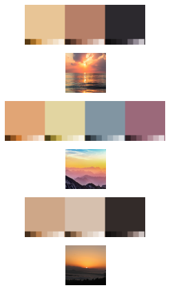

# smart-colour-extraction
This project is aimed at automatically extracting important colours from a variety of images. The strength of this algorithm lies in detecting salient colours even when the occupy only a few pixels. This work uses the median-cut algorithm as its backbone and improves upon it by using techniques such as adaptive blur and HSL sorting. It also provides keyword searching compatibility with the Unsplash API, and a tagged custom image dataset.

The previous work for the median-cut algorithm can be found [here](https://github.com/Stack-of-Pancakes/median_cut_color_quantization).

## Unsplash API
1. You need to create an account in Unsplash and generate an API key.
2. Copy your key, and paste it in the [Notebook](https://github.com/Abhishek-Iyer1/smart-colour-extraction/blob/main/Keyword_Palette_Generation.ipynb)
3. Input keywords separated by commas, and the number of results you would like to see the output of.
4. You will see similar results as seen below: 

 

## Custom Dataset
1. Create your custom dataset by following the below shown file structure
    -Custom Dataset
      |_ images
        001.jpg
        ...
      |_ annotations
        annotations.xlsx
2. Upload to your drive or locally and change the path in the Custom Dataset cell. Make sure your .xlsx file has the same columns (Image Name, Filepath, and Keywords) as the one in IR Dataset.
3 Input keywords and you will see a similar output as above.

